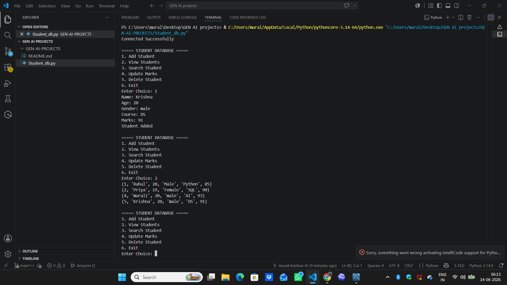
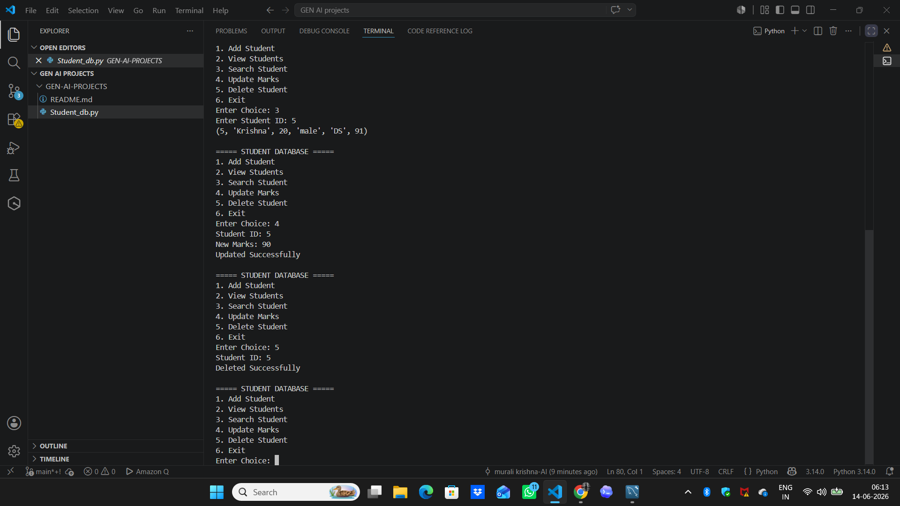

# Student Database Management System

A command-line based Student Database Management System built using **Python** and **MySQL**. This project allows users to perform CRUD (Create, Read, Update, Delete) operations on student records stored in a MySQL database.

## Features

* Add new students
* View all student records
* Search students by ID
* Update student marks
* Delete student records
* MySQL database integration
* Menu-driven interface

## Technologies Used

* Python 3
* MySQL
* mysql-connector-python
* SQL

## Project Structure

```text
python-mysql-student-database/
│
├── Student_database.py
├── README.md
```

## Database Schema

### Table: students

| Column | Data Type    |
| ------ | ------------ |
| id     | INT          |
| name   | VARCHAR(100) |
| age    | INT          |
| gender | VARCHAR(20)  |
| course | VARCHAR(100) |
| marks  | INT          |

## Installation

### 1. Clone the Repository

```bash
git clone https://github.com/muralitirumanadham-maker/python-mysql-student-database.git
```

### 2. Install Required Package

```bash
pip install mysql-connector-python
```

### 3. Create Database

```sql
CREATE DATABASE student_db;

USE student_db;

CREATE TABLE students(
    id INT PRIMARY KEY AUTO_INCREMENT,
    name VARCHAR(100),
    age INT,
    gender VARCHAR(20),
    course VARCHAR(100),
    marks INT
);
```

### 4. Configure MySQL Credentials

Update your MySQL username and password inside `Student_database.py`.

### 5. Run the Project

```bash
python Student_database.py
```

## Screenshots

### Main Menu

Shows the available operations.

### Add and View Students

Students can be added and displayed from the database.



### Search Student

Search,update,delete student records using Student ID.




## Sample Operations

### Add Student

```text
Enter Choice: 1
Name: Krishna
Age: 20
Gender: Male
Course: DS
Marks: 91
Student Added
```

### Search Student

```text
Enter Choice: 3
Enter Student ID: 5
(5, 'Krishna', 20, 'male', 'DS', 91)
```

### Update Marks

```text
Enter Choice: 4
Student ID: 5
New Marks: 90
Updated Successfully
```

### Delete Student

```text
Enter Choice: 5
Student ID: 5
Deleted Successfully
```

## Future Improvements

* Student attendance tracking
* Grade calculation system
* Export data to Excel/CSV
* GUI using Tkinter
* Web application using Flask
* Authentication and user roles

## Author

**Murali Tirumanadham**

Learning Python, SQL, Cloud Computing, DSA, and AI through hands-on projects.
